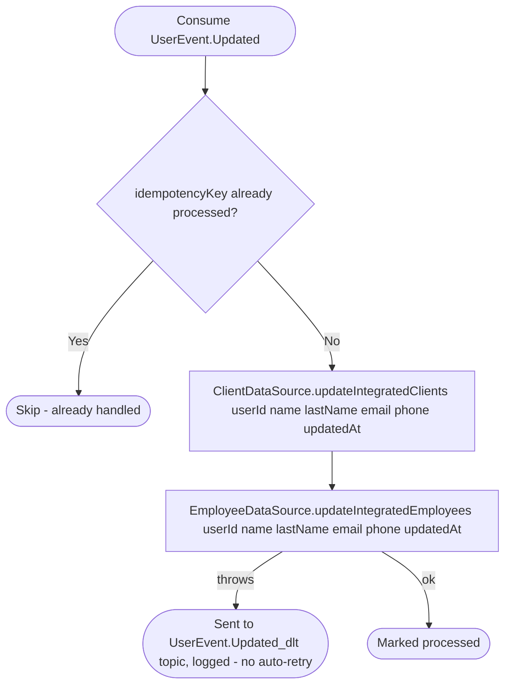

# React to user profile update

Kafka topic `UserEvent.Updated` → `BusinessEventHandlerImpl` → `SyncUserProfile`

Produced by [Update user](../user/update-user.md). Business keeps
denormalized copies of a user's name/last name/email/phone on any
`Client.Integrated` or `Employee` row linked to that `userId` (so listing
clients/employees doesn't need a live call to the user service); this
keeps those copies from going stale.

