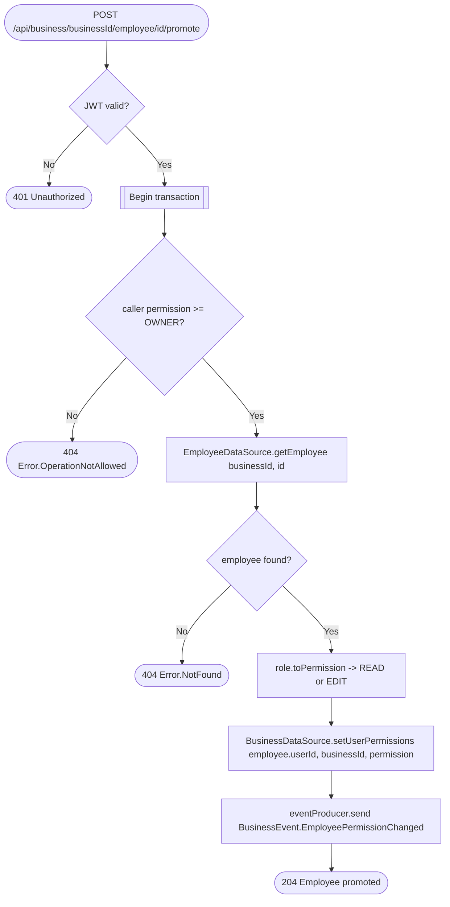

# Promote employee

`POST /api/business/{businessId}/employee/{id}/promote` → `PromoteEmployee`

Only the business owner can change an employee's permission level. `role`
in the request body is one of `EMPLOYEE`/`MANAGER`, mapped to
`ObjectPermission.READ`/`ObjectPermission.EDIT` and written to
`BusinessPermissionsTable` for the employee's `userId`; the `Employee` row
itself is unchanged. See [Object permissions](../../object-permissions.md)
for what each level allows.

**Consumed by:** `BusinessEvent.EmployeePermissionChanged` → [appointments:
sync employee permission](../appointments/on-employee-permission-changed.md).
