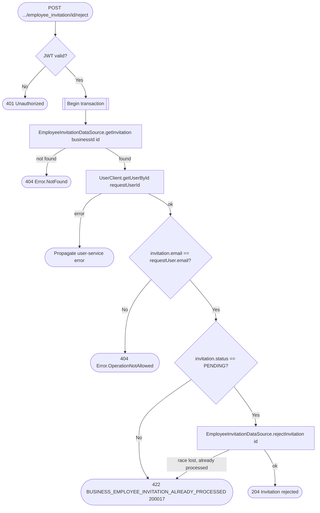

# Reject employee invitation

`POST /api/business/{businessId}/employee_invitation/{id}/reject` → `RejectEmployeeInvitation`

Only the invited email's own user can reject their invitation — the caller
identity is cross-checked against the invitation's `email` via the user
service, and a mismatch is reported as the same 404 as a missing invitation
so an attacker can't distinguish "not invited" from "invited someone
else". Rejection only flips the invitation's status; it does not touch
`Employee` or `BusinessPermissionsTable`, and no cross-service event is
published.

