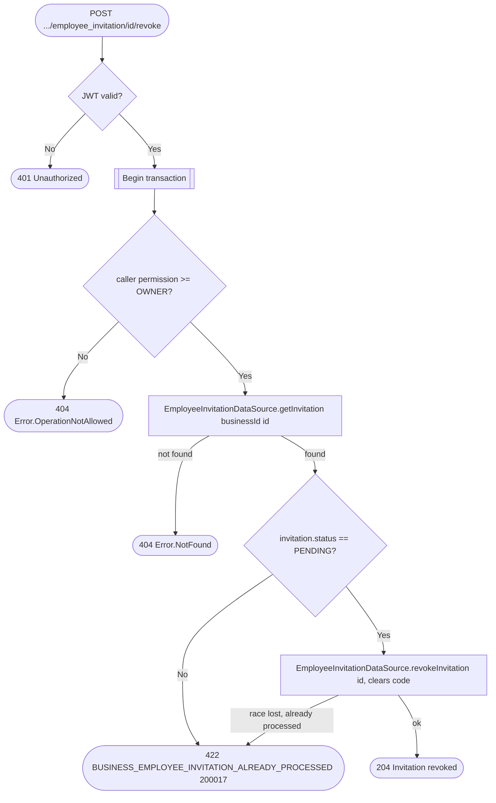

# Revoke employee invitation

`POST /api/business/{businessId}/employee_invitation/{id}/revoke` → `RevokeEmployeeInvitation`

Only the business owner can revoke an invitation, and only while it is
still `PENDING` — this lets an owner invalidate a shared invite code
before it is redeemed (or before it expires on its own via the
`expireEmployeeInvitations` scheduled job, see [Scheduled (recurring)
jobs](../scheduled-jobs.md)). The caller is checked via `ObjectPermission`.
Revocation flips the invitation's status and clears its `code` column
(nullable, see [Invite employee](create-employee-invitation.md)) so the
code is freed for reuse; it does not touch `Employee` or
`BusinessPermissionsTable`, and no cross-service event is published.

