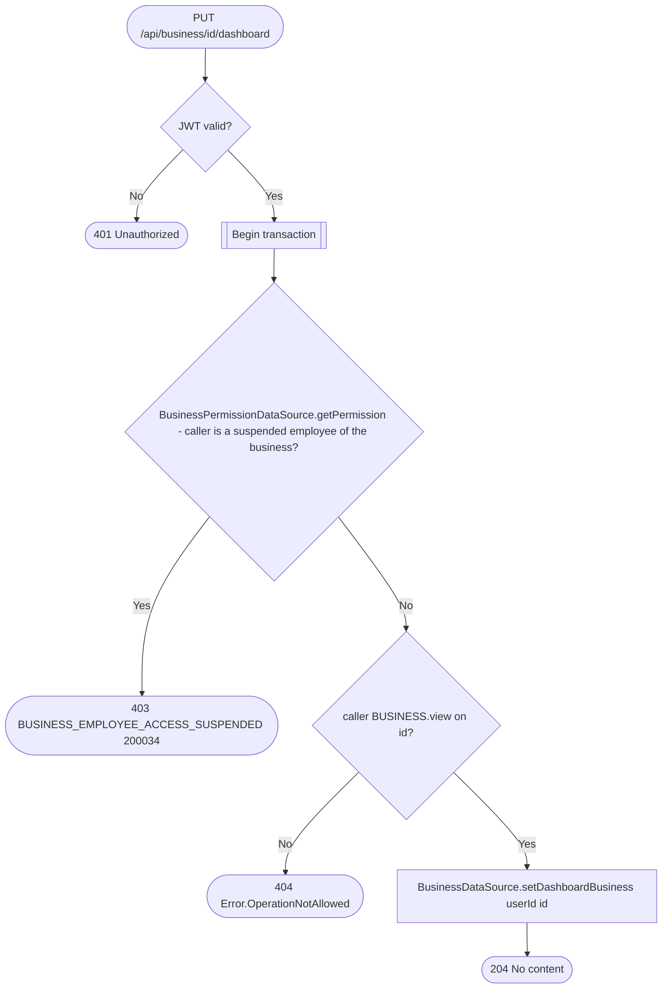

# Set dashboard business

`PUT /api/business/{id}/dashboard` → `SetDashboardBusiness`

```mermaid
flowchart TD
    Start([PUT /api/business/id/dashboard]) --> Auth{JWT valid?}
    Auth -- No --> R401([401 Unauthorized])
    Auth -- Yes --> Tx[[Begin transaction]]
    Tx --> Suspended{BusinessPermissionDataSource.getPermission - caller is a suspended employee of the business?}
    Suspended -- Yes --> R403s([403 BUSINESS_EMPLOYEE_ACCESS_SUSPENDED 200034])
    Suspended -- No --> Perm{caller BUSINESS.view on id?}
    Perm -- No --> R404([404 Error.OperationNotAllowed])
    Perm -- Yes --> Set[BusinessDataSource.setDashboardBusiness userId id]
    Set --> R204([204 No content])
```
