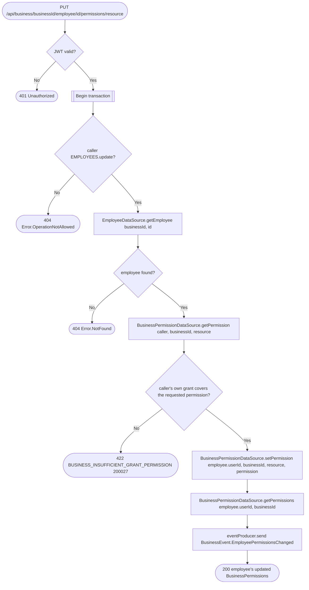

# Set employee permission

`PUT /api/business/{businessId}/employee/{id}/permissions/{resource}` → `SetEmployeePermission`

Grants or revokes independent `view`/`update`/`delete` access to one
`BusinessResource` for one employee at a time — there is no fixed role
anymore. The caller needs `EMPLOYEES.update` to manage permissions at all,
and additionally cannot hand out more access to the target resource than
they themselves hold (`.covers()`) — you cannot delegate what you don't
have. The `Employee` row itself is unchanged. See [Resource
permissions](../../object-permissions.md) for the full model.

**Consumed by:** `BusinessEvent.EmployeePermissionsChanged` → [appointments:
sync employee permissions](../appointments/on-employee-permissions-changed.md).
