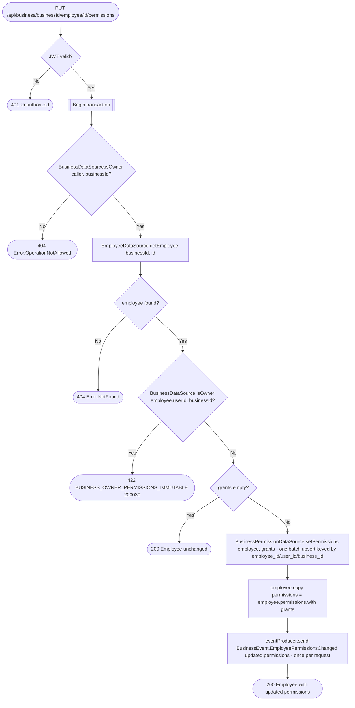

# Set employee permissions

`PUT /api/business/{businessId}/employee/{id}/permissions` → `SetEmployeePermissions`

Grants or revokes independent `view`/`update`/`delete` access to one or more
`BusinessResource`s for one employee in a single request. The body,
`EmployeePermissionsRequest`, has one optional `ResourcePermission` field per
resource — `business` (1), `employees` (2), `clients` (3), `services` (4),
`appointments` (5), proto field numbers in brackets — so every key is named in
the OpenAPI schema instead of being a bare enum ordinal inside a map. An
omitted field keeps that resource's current grant; the route turns the
present fields into the `Map<BusinessResource, ResourcePermission>` the
operation takes (`EmployeePermissionsRequest.grants()`). Only the business
owner (`BusinessDataSource.isOwner`) can manage permissions — holding
`EMPLOYEES.update` (even `FULL` on every resource) is not enough, and a
non-owner caller gets 404 like any other permission failure. The business owner's permissions are
immutable — the owner always holds `FULL` on every resource — so targeting
the owner's employee record is rejected before anything else is checked
about the grants. A body with every field omitted (an empty map) is a no-op that returns the
employee unchanged. The `Employee` row itself is unchanged; the response is
the `Employee` with its merged `permissions`, computed in memory as
`employee.permissions.with(grants)` rather than re-read. See [Resource
permissions](../../object-permissions.md) for the full model.

**Consumed by:** `BusinessEvent.EmployeePermissionsChanged` → [appointments:
sync employee permissions](../appointments/on-employee-permissions-changed.md).
