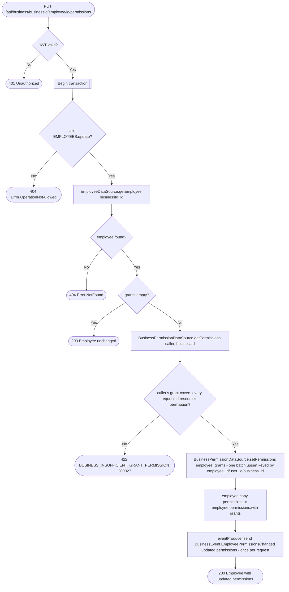

# Set employee permissions

`PUT /api/business/{businessId}/employee/{id}/permissions` → `SetEmployeePermissions`

Grants or revokes independent `view`/`update`/`delete` access to one or more
`BusinessResource`s for one employee in a single request. The body,
`EmployeePermissionsRequest`, is a `Map<BusinessResource, ResourcePermission>`:
resources not listed keep their current grants. The caller needs
`EMPLOYEES.update` to manage permissions at all, and additionally cannot
hand out more access to any listed resource than they themselves hold
(`.covers()`) — you cannot delegate what you don't have. The check is
all-or-nothing: if a single grant exceeds the caller's own, nothing is
written and no event is sent. An empty map is a no-op that returns the
employee unchanged. The `Employee` row itself is unchanged; the response is
the `Employee` with its merged `permissions`, computed in memory as
`employee.permissions.with(grants)` rather than re-read. See [Resource
permissions](../../object-permissions.md) for the full model.

**Consumed by:** `BusinessEvent.EmployeePermissionsChanged` → [appointments:
sync employee permissions](../appointments/on-employee-permissions-changed.md).
