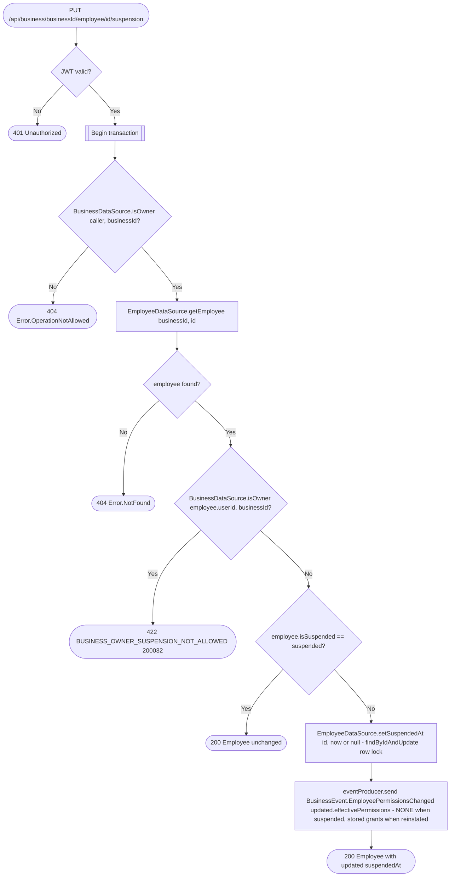

# Set employee suspension

`PUT /api/business/{businessId}/employee/{id}/suspension` → `SetEmployeeSuspension`

Suspends an employee (`suspended = true`) or reinstates a suspended one
(`suspended = false`). The body, `EmployeeSuspensionRequest`, has a single
`suspended` field (proto field 1). Suspension is stored as
`employee.suspended_at` (`Employee.suspendedAt`, stamped with the current
time, cleared on reinstatement). The employee's grants in
`business_permission_grants` are **not** touched: `getPermission` /
`getPermissions` join the employee row and treat a suspended employee as
holding `NONE`, so every permission-gated operation rejects them with no
change of its own, and reinstating restores exactly the grants they had.
A suspended employee also cannot be booked by clients — see [Get
appointment booking context](#booking) below.

Only the business owner (`BusinessDataSource.isOwner`) can suspend or
reinstate; a non-owner gets 404 like any other permission failure. The
owner's own employee record cannot be suspended. Requesting the state the
employee is already in is a no-op that returns the employee unchanged and
publishes nothing.

The appointments service keeps its own copy of the appointments grant, so
the change is published as the existing
`BusinessEvent.EmployeePermissionsChanged` carrying the employee's
**effective** permissions (`Employee.effectivePermissions()`): `NONE` on
suspension, the stored grants on reinstatement. No dedicated suspension
event or handler exists.

## Effect on booking

`GetAppointmentBookingContext` (the internal
`POST /api/internal/business/{id}/appointment-booking-context` route that
`CreateAppointmentRequest` calls) rejects a suspended employee with
`422 BUSINESS_EMPLOYEE_SUSPENDED (200033)` right after resolving the
employee, before the client record is looked up or created. The appointments
service passes that error straight through to the client.

**Consumed by:** `BusinessEvent.EmployeePermissionsChanged` → [appointments:
sync employee permissions](../appointments/on-employee-permissions-changed.md).
