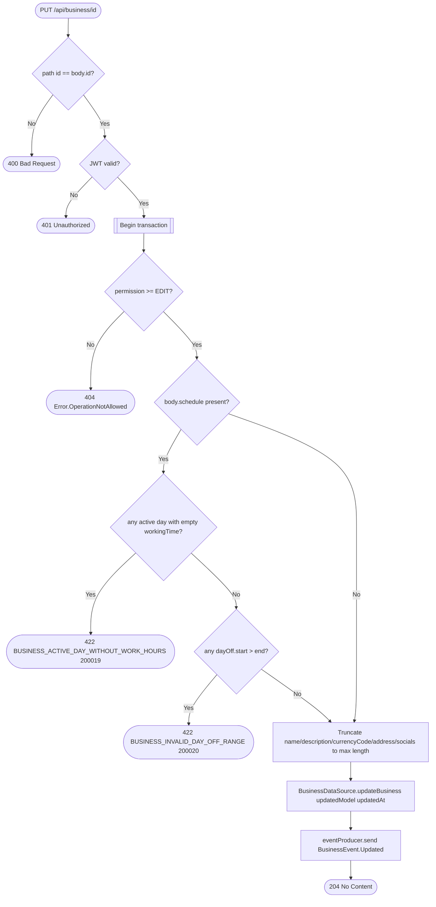

# Update business

`PUT /api/business/{id}` → `UpdateBusiness`

Partial update: every field on `BusinessUpdateModel` is nullable and only
non-null fields are applied. String fields are silently truncated to the
entity's max length rather than rejected. Publishes `BusinessEvent.Updated`
so other services (appointments' business snapshot, in particular) stay in
sync.

**Consumed by:** `BusinessEvent.Updated` → [appointments: refresh the
cached business snapshot](../appointments/on-business-updated.md).
