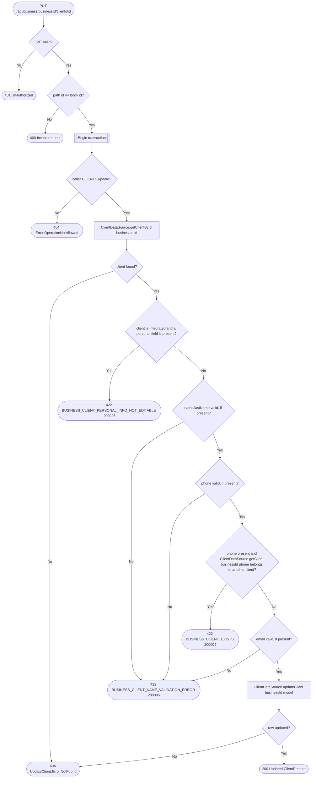

# Update client

`PUT /api/business/{businessId}/clients/{id}` → `UpdateClient`

Non-null fields on the request are applied, all others are left
unchanged. Personal info (`name`, `lastName`, `phone`, `email`) can only be
changed for a `Detached` client — an `Integrated` client's personal info is
synced from its linked user profile (see `SyncUserProfile`), so any of
those fields present on the request for an `Integrated` client is
rejected; only its `description` can be edited either way.

