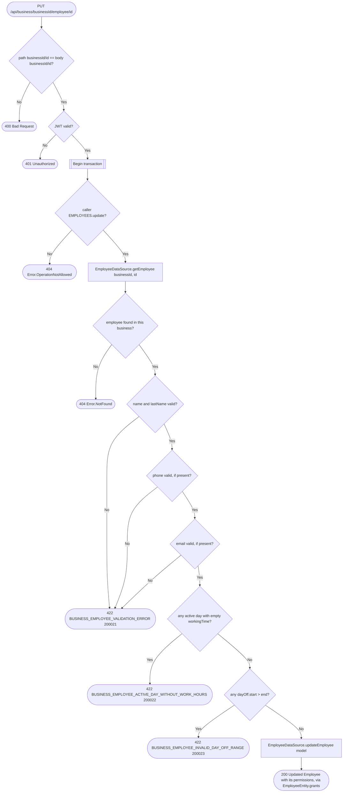

# Update employee

`PUT /api/business/{businessId}/employee/{id}` → `UpdateEmployee`

A full-record replace covering profile fields, schedule and provided
services in one write. The body is `EmployeeUpdateModel`, not `Employee`:
permissions are not editable here (they change only through [Set employee
permissions](set-employee-permissions.md), which enforces the `.covers()`
delegation rule and publishes `EmployeePermissionsChanged`). Its proto field
numbers match `Employee`'s, so a client still sending a full `Employee`
decodes cleanly and the extra fields are ignored. The target employee is
looked up by `(businessId, id)` before the write, so a caller holding
`EMPLOYEES.update` on one business cannot edit another business's employee
by id.

