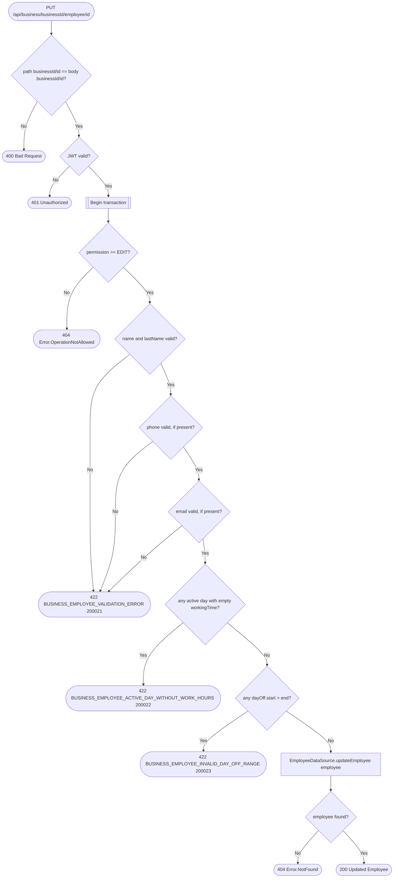

# Update employee

`PUT /api/business/{businessId}/employee/{id}` → `UpdateEmployee`

A full-record replace covering profile fields, schedule and provided
services in one write.

```mermaid
flowchart TD
    Start([PUT /api/business/businessId/employee/id]) --> PathCheck{path businessId/id == body businessId/id?}
    PathCheck -- No --> R400([400 Bad Request])
    PathCheck -- Yes --> Auth{JWT valid?}
    Auth -- No --> R401([401 Unauthorized])
    Auth -- Yes --> Tx[[Begin transaction]]
    Tx --> Perm{permission >= EDIT?}
    Perm -- No --> R404a([404 Error.OperationNotAllowed])
    Perm -- Yes --> NameCheck{name and lastName valid?}
    NameCheck -- No --> R422a([422 BUSINESS_EMPLOYEE_VALIDATION_ERROR 200021])
    NameCheck -- Yes --> PhoneCheck{phone valid, if present?}
    PhoneCheck -- No --> R422a
    PhoneCheck -- Yes --> EmailCheck{email valid, if present?}
    EmailCheck -- No --> R422a
    EmailCheck -- Yes --> WorkHours{any active day with empty workingTime?}
    WorkHours -- Yes --> R422b([422 BUSINESS_EMPLOYEE_ACTIVE_DAY_WITHOUT_WORK_HOURS 200022])
    WorkHours -- No --> DayOffRange{any dayOff.start > end?}
    DayOffRange -- Yes --> R422c([422 BUSINESS_EMPLOYEE_INVALID_DAY_OFF_RANGE 200023])
    DayOffRange -- No --> Update[EmployeeDataSource.updateEmployee employee]
    Update --> Found{employee found?}
    Found -- No --> R404b([404 Error.NotFound])
    Found -- Yes --> R200([200 Updated Employee])
```
