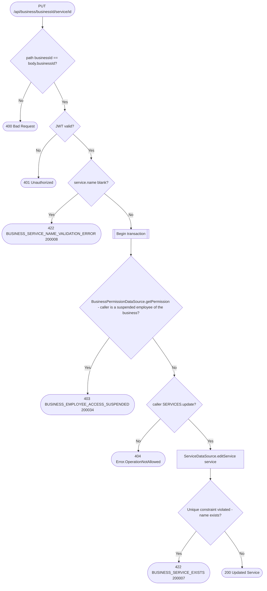

# Update service

`PUT /api/business/{businessId}/service/{id}` → `UpdateService`

```mermaid
flowchart TD
    Start([PUT /api/business/businessId/service/id]) --> PathCheck{path businessId == body.businessId?}
    PathCheck -- No --> R400([400 Bad Request])
    PathCheck -- Yes --> Auth{JWT valid?}
    Auth -- No --> R401([401 Unauthorized])
    Auth -- Yes --> NameCheck{service.name blank?}
    NameCheck -- Yes --> R422a([422 BUSINESS_SERVICE_NAME_VALIDATION_ERROR 200008])
    NameCheck -- No --> Tx[[Begin transaction]]
    Tx --> Suspended{BusinessPermissionDataSource.getPermission - caller is a suspended employee of the business?}
    Suspended -- Yes --> R403s([403 BUSINESS_EMPLOYEE_ACCESS_SUSPENDED 200034])
    Suspended -- No --> Perm{caller SERVICES.update?}
    Perm -- No --> R404([404 Error.OperationNotAllowed])
    Perm -- Yes --> Edit[ServiceDataSource.editService service]
    Edit --> Constraint{Unique constraint violated - name exists?}
    Constraint -- Yes --> R422b([422 BUSINESS_SERVICE_EXISTS 200007])
    Constraint -- No --> R200([200 Updated Service])
```
