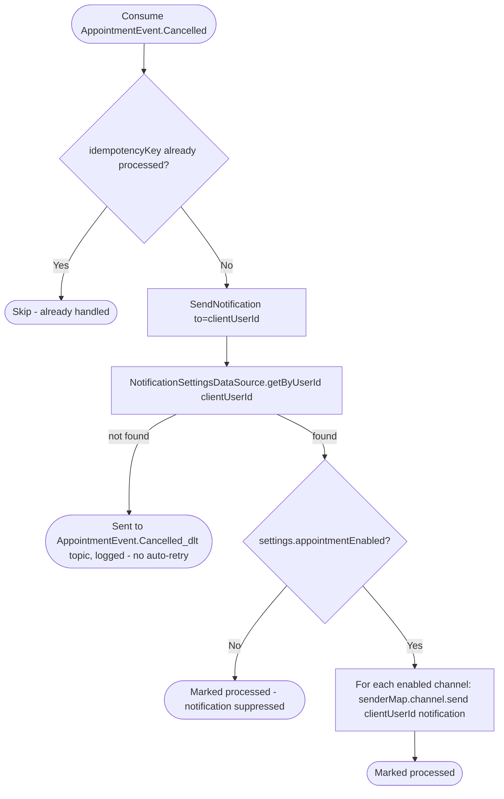

# React to appointment cancellation

Kafka topic `AppointmentEvent.Cancelled` → `NotificationEventHandler` → `SendNotification`

Produced by [Cancel appointment](../appointments/cancel-appointment.md).
Notifies the client their appointment was cancelled.

