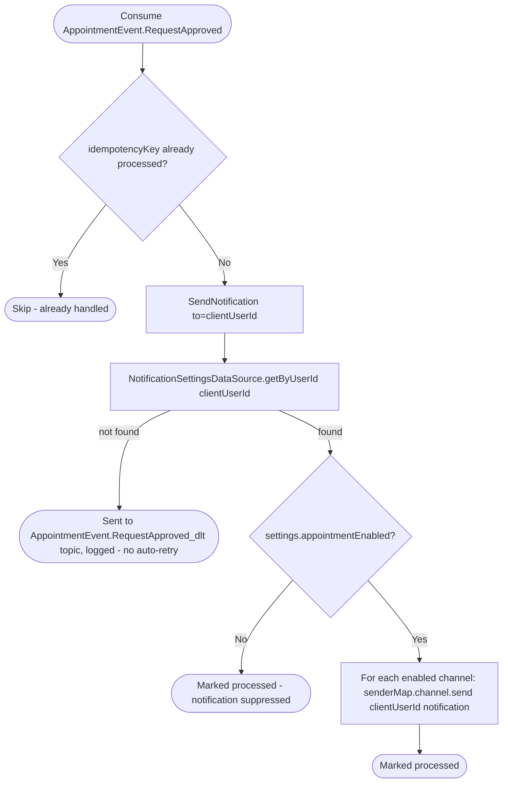

# React to appointment request approval

Kafka topic `AppointmentEvent.RequestApproved` → `NotificationEventHandler` → `SendNotification`

Produced from two places that share the same underlying approval code:
[Create appointment from a pending
request](../appointments/create-appointment-from-request.md), and the
automatic-approval branch inside [Create appointment
request](../appointments/create-appointment-request.md) (when the business
has `automaticApproval` on). Notifies the client their request was
accepted.

