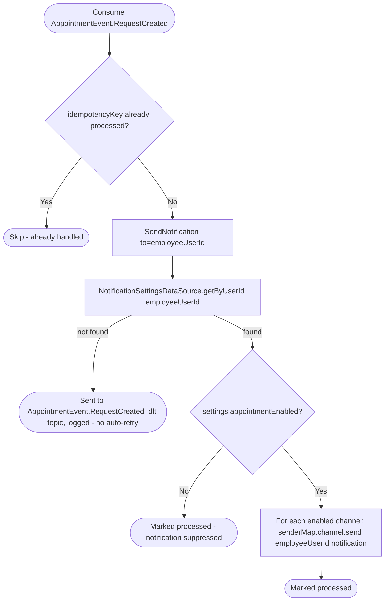

# React to appointment request creation

Kafka topic `AppointmentEvent.RequestCreated` → `NotificationEventHandler` → `SendNotification`

Produced by [Create appointment request](../appointments/create-appointment-request.md)
(the manual-approval path only — see [Send
notification](#shared-send-notification-behavior) below). Notifies the
employee a new request is waiting for them.

### Shared `SendNotification` behavior

Every `AppointmentEvent.*` and `BusinessEvent.EmployeeInvitation*` reaction
below funnels through the same `SendNotification` operation: look up the
recipient's settings, skip silently if the notification type is disabled
(appointment notifications are user-suppressible; employee-invitation ones
are not — see [Invite employee](../business/create-employee-invitation.md)'s
diagram), then fan out to every channel (push/email/etc.) the recipient has
enabled.
