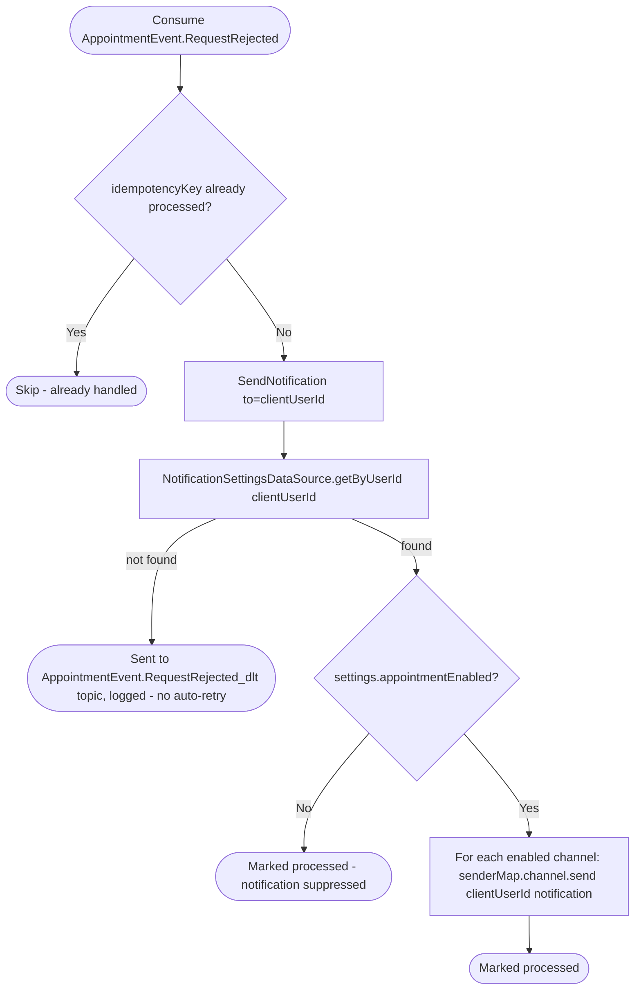

# React to appointment request decline

Kafka topic `AppointmentEvent.RequestRejected` → `NotificationEventHandler` → `SendNotification`

Produced by [Decline appointment request](../appointments/decline-appointment-request.md).
Notifies the client their request was declined.

