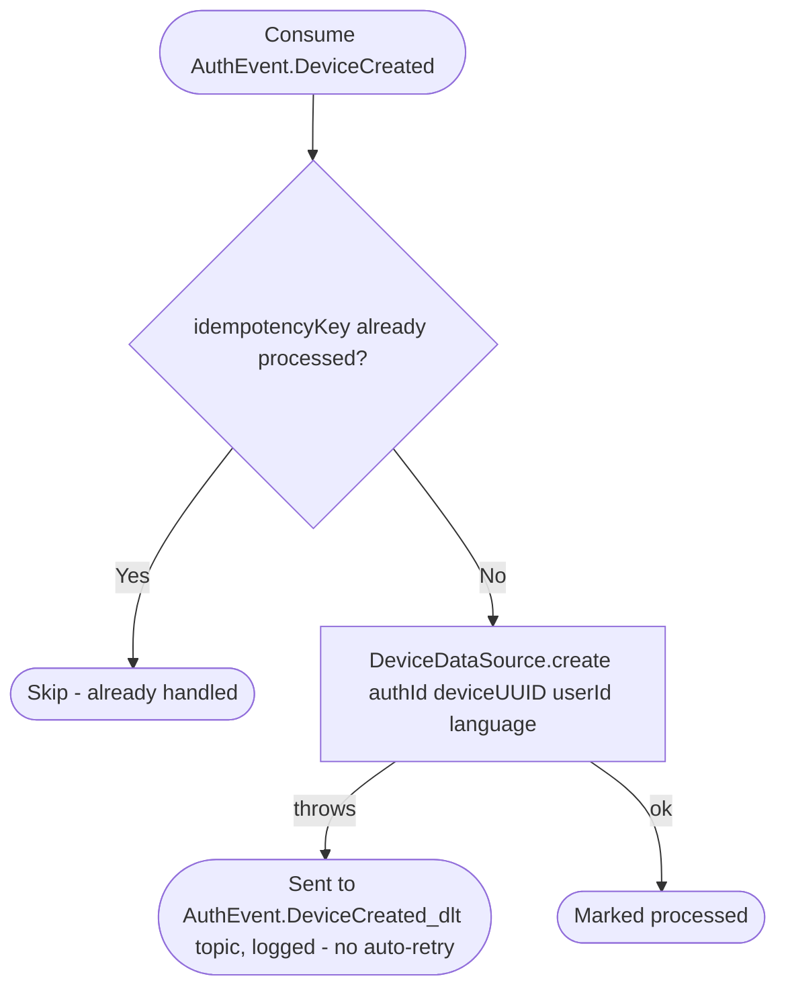

# React to device creation

Kafka topic `AuthEvent.DeviceCreated` → `NotificationEventHandler` → `CreateDeviceEntry`

Produced whenever a device signs in for the first time: [Verify sign-up
(create account)](../authorization/sign-up.md) or [Verify
sign-in](../authorization/sign-in.md). Mirrors the device row locally so
push tokens and language preference can be tracked without a live call to
the authorization service.

