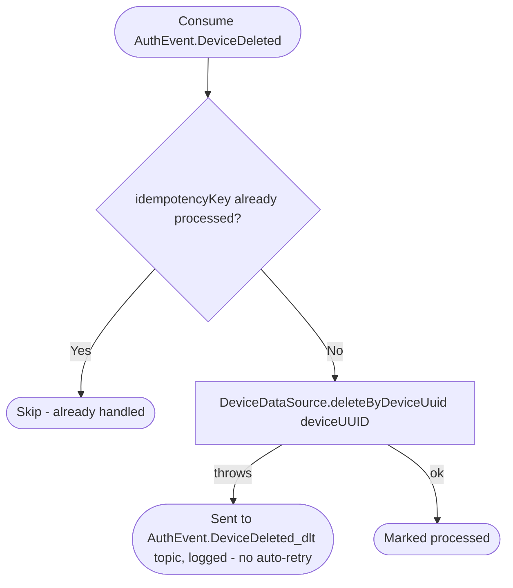

# React to device deletion

Kafka topic `AuthEvent.DeviceDeleted` → `NotificationEventHandler` → `DeleteDeviceByUUID`

Produced once per device by [Delete account](../authorization/delete-account.md)
(one event per device the deleted account had signed in on). Removes the
device's push-token row.

