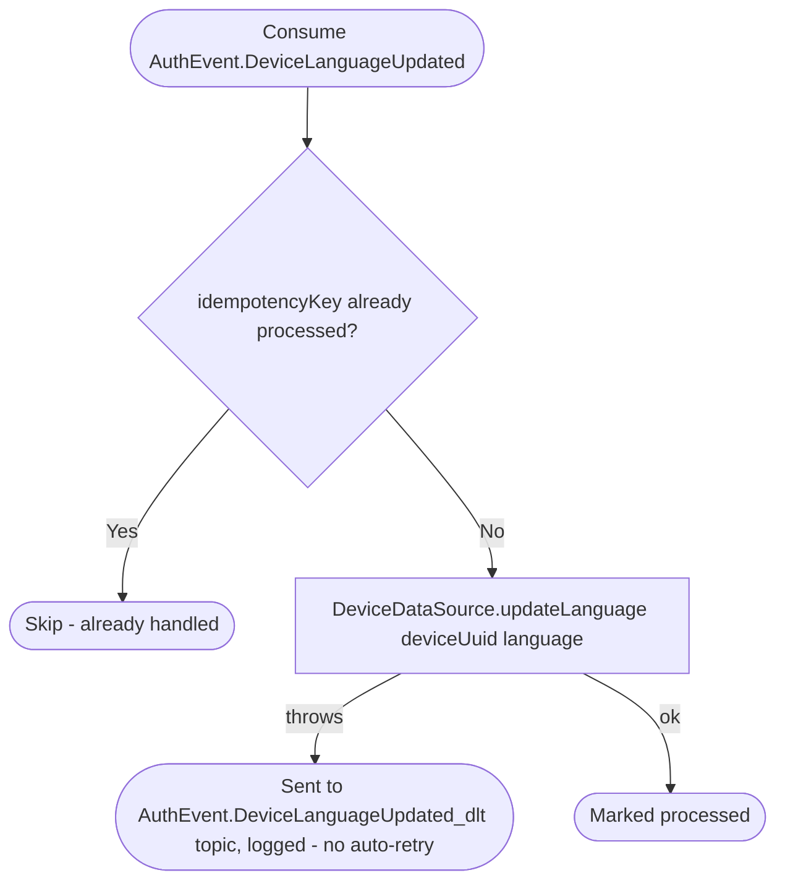

# React to device language change

Kafka topic `AuthEvent.DeviceLanguageUpdated` → `NotificationEventHandler` → `UpdateDeviceLanguage`

Produced by [Verify sign-in](../authorization/sign-in.md) when a
previously-known device signs in again with a different `Accept-Language`.
Keeps the locale used to render push/email notifications current.

