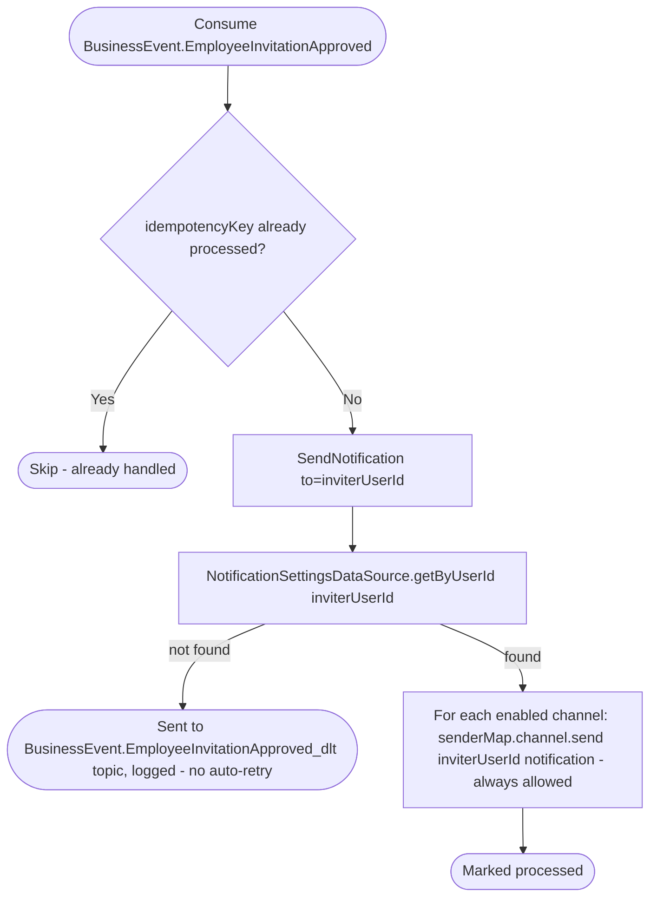

# React to employee invitation approval

Kafka topic `BusinessEvent.EmployeeInvitationApproved` → `NotificationEventHandler` → `SendNotification`

Produced by [Approve employee invitation](../business/approve-employee-invitation.md).
Notifies the inviter (not the newly-approved employee) that their
invitation was accepted. Same suppression rules as [employee invitation
created](on-employee-invitation-created.md): always allowed, channel
selection only.

