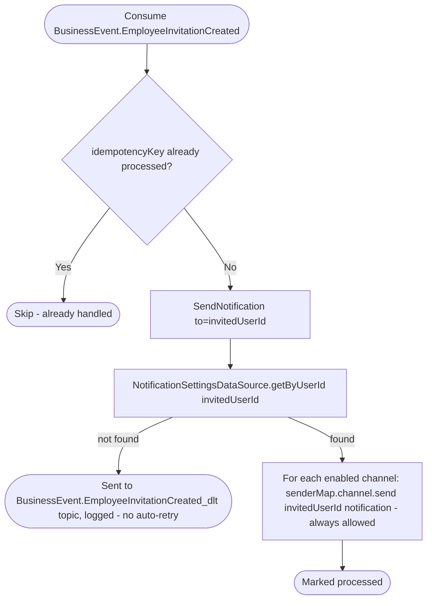

# React to employee invitation creation

Kafka topic `BusinessEvent.EmployeeInvitationCreated` → `NotificationEventHandler` → `SendNotification`

Produced by [Invite employee](../business/create-employee-invitation.md).
Notifies the invited user. Unlike appointment notifications, this type is
account-level and not user-suppressible via `appointmentEnabled` — it
still only reaches channels the user has individually enabled.

