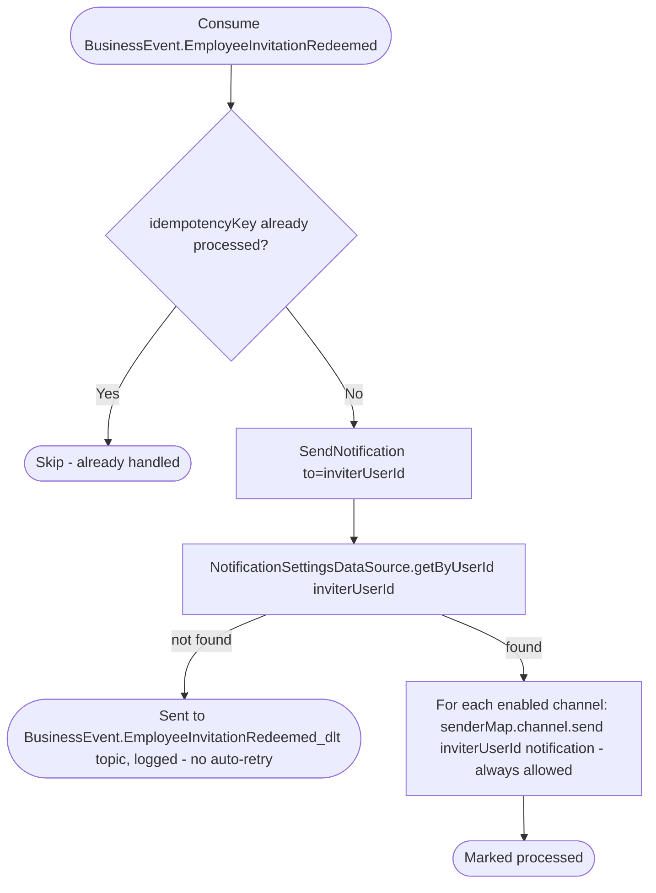

# React to an employee joining the business

Kafka topic `BusinessEvent.EmployeeInvitationRedeemed` → `NotificationEventHandler` → `SendNotification`

Produced by [Join business](../business/join-business.md).
Notifies the inviter (not the newly-joined employee) that their invitation
was redeemed. Always allowed, channel selection only.

