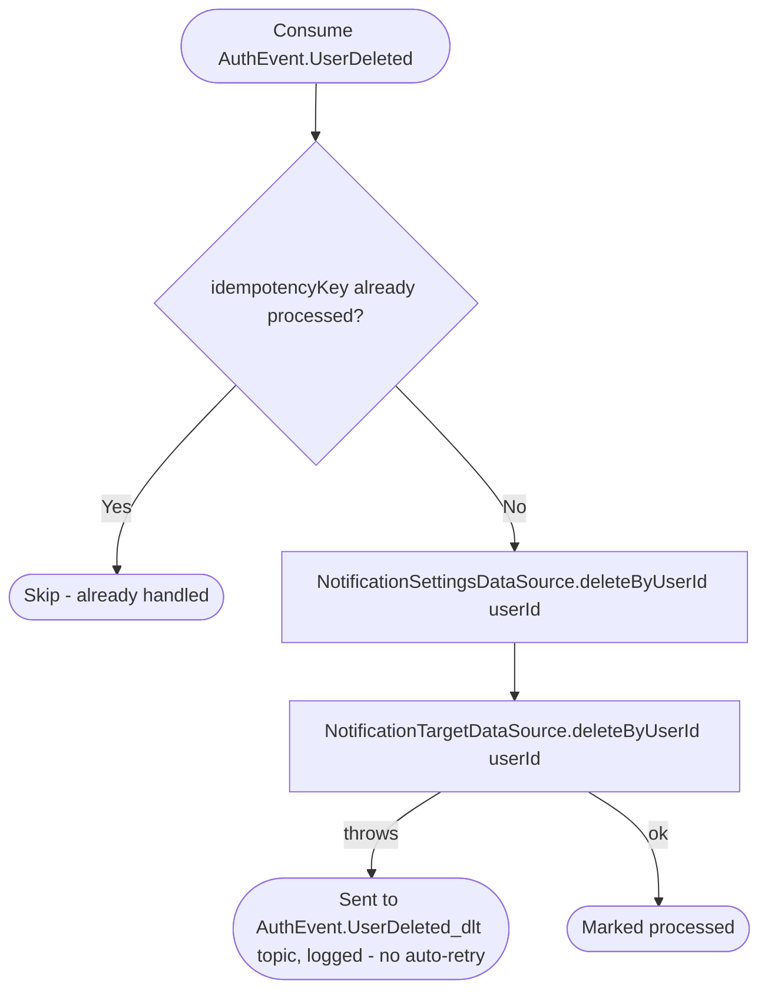

# React to user deletion

Kafka topic `AuthEvent.UserDeleted` → `NotificationEventHandler` → `DeleteUserNotificationData`

Produced by [Delete account](../authorization/delete-account.md). Removes
notification preferences and delivery targets (email/Telegram); device
rows themselves are removed separately, per device, by [React to device
deletion](on-device-deleted.md).

