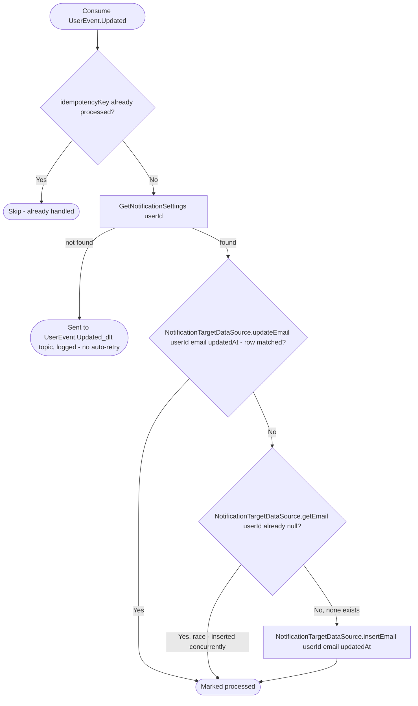

# React to user profile update

Kafka topic `UserEvent.Updated` → `NotificationEventHandler` → `UpdateTargetInformation`

Produced by [Update user](../user/update-user.md). Keeps the user's email
delivery target in sync with their profile email; requires notification
settings to already exist (created lazily elsewhere), so an update for a
user with none is treated as a failure rather than silently creating them.

