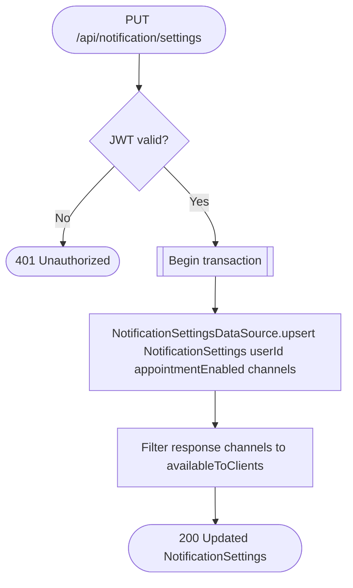

# Update notification settings

`PUT /api/notification/settings` → `UpdateNotificationSettings`

An upsert keyed on the caller's `userId`: the first call creates the row,
every later call overwrites it. The response strips channels not marked
`availableToClients` before returning.

