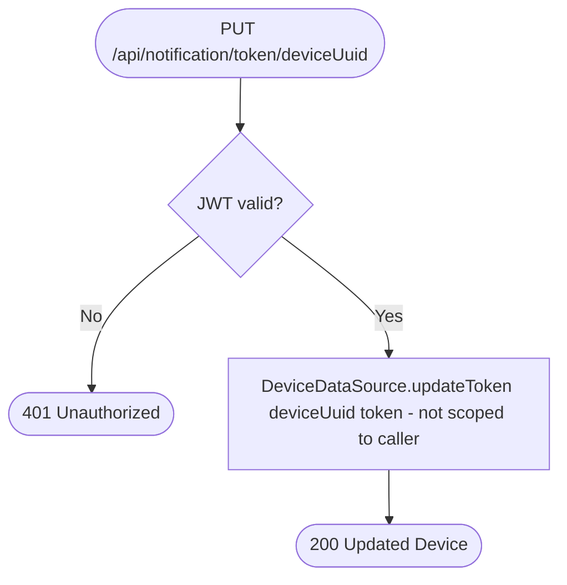

# Update push notification token

`PUT /api/notification/token/{deviceUuid}` → `UpdatePushNotificationToken`

Requires a valid JWT to reach the handler, but the target device comes
from the path parameter rather than the JWT principal — the handler never
checks that `deviceUuid` belongs to the caller.

