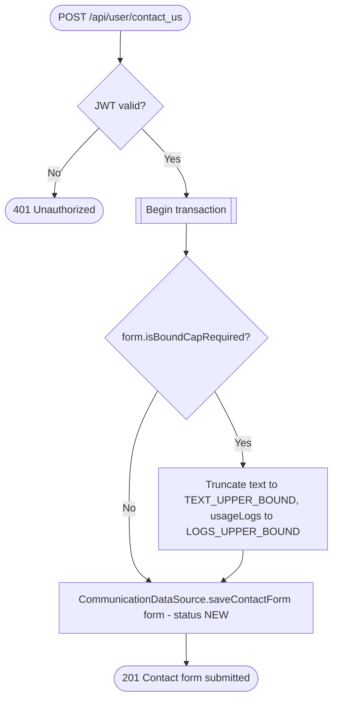

# Send contact form

`POST /api/user/contact_us` → `CreateContactForm`

Free-text support submission tied to the caller. Oversized `text`/
`usageLogs` are silently truncated to their upper bounds rather than
rejected, when `form.isBoundCapRequired` applies.

