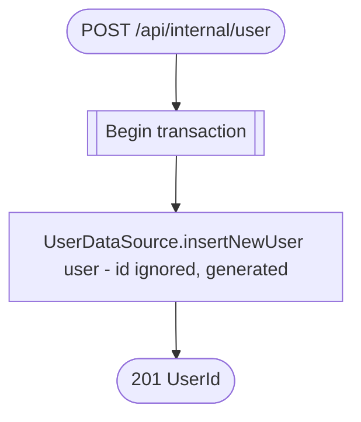

# Create user (internal)

`POST /api/internal/user` → `CreateUser`

Service-to-service route (no `authenticate {}`/`Security: jwt` — reachable
only from inside the deployment, e.g. from the authorization service
during [Sign-up](../authorization/sign-up.md)). Ignores any `id` on the
incoming `User` and lets the datasource assign one.

