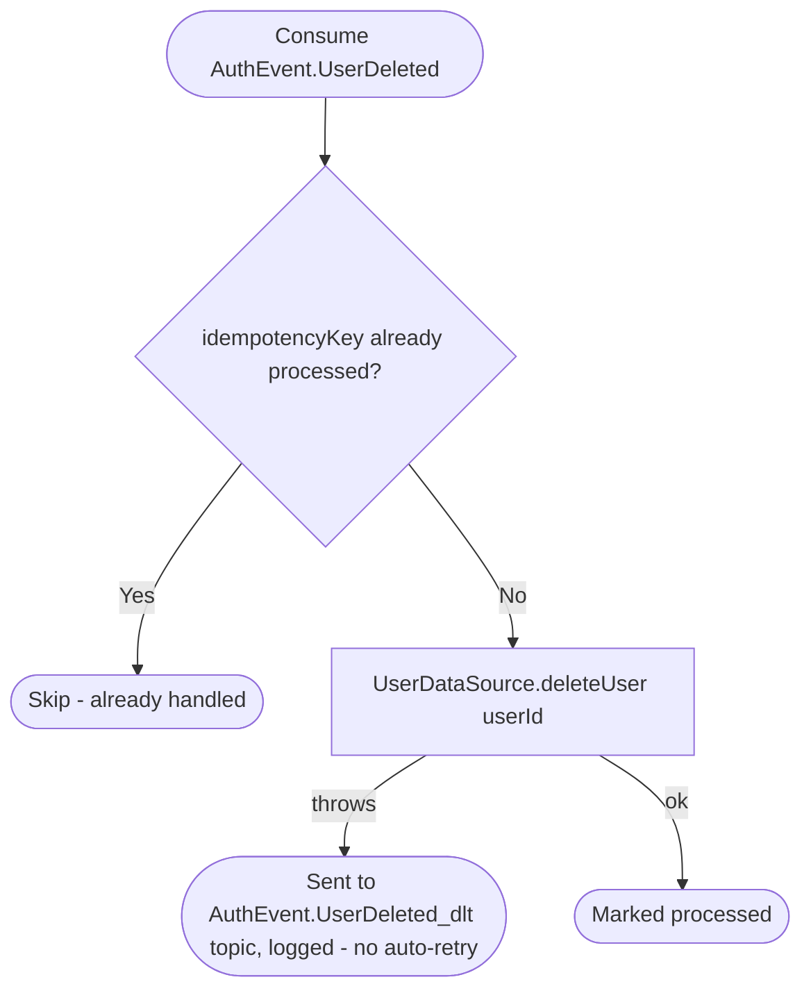

# React to user deletion

Kafka topic `AuthEvent.UserDeleted` → `UserEventHandler` → `DeleteUser`

Produced by [Delete account](../authorization/delete-account.md). The user
service owns the profile row itself, so this is a hard delete — the other
consumers ([business](../business/on-user-deleted.md),
[appointments](../appointments/on-user-deleted.md),
[notifications](../notifications/on-user-deleted.md)) anonymize or clean up
their own denormalized copies independently and in no guaranteed order
relative to this one.

