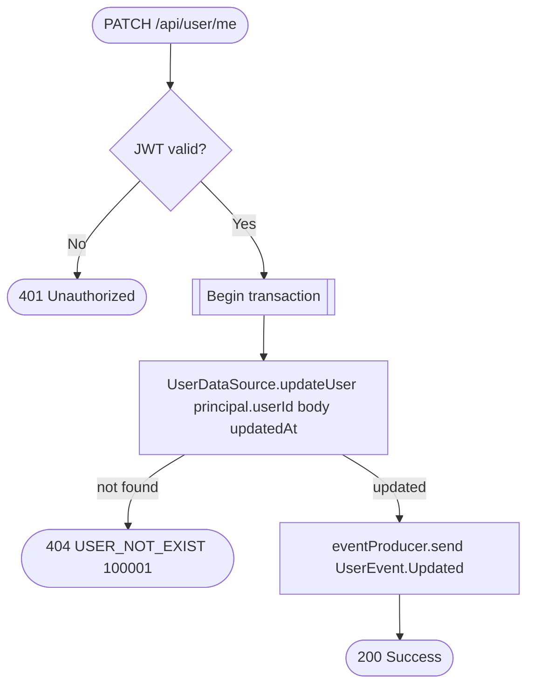

# Update user

`PATCH /api/user/me` → `EditUser`

Partial update of the caller's own profile; publishes `UserEvent.Updated`
so other services (business employee records, appointments client
snapshots) can react.

**Consumed by:** `UserEvent.Updated` → [business: sync denormalized client/
employee copies](../business/on-user-updated.md) and [notifications: sync
the email delivery target](../notifications/on-user-updated.md).
